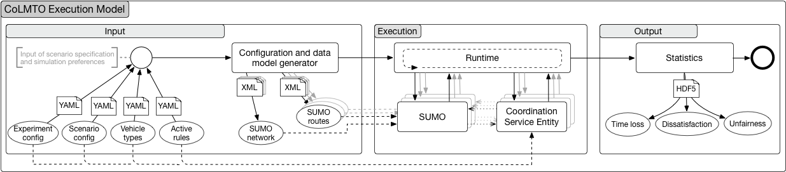

<!-- START doctoc generated TOC please keep comment here to allow auto update -->
<!-- DON'T EDIT THIS SECTION, INSTEAD RE-RUN doctoc TO UPDATE -->
**Table of Contents**

- [Cooperative Lane Management and Traffic flow Optimisation (CoLMTO)](#cooperative-lane-management-and-traffic-flow-optimisation-colmto)
  - [Architecture](#architecture)
  - [Build Instructions](#build-instructions)
    - [Prerequisites](#prerequisites)
    - [Checkout CoLMTO](#checkout-colmto)
    - [Build SUMO Submodule (optional)](#build-sumo-submodule-optional)
    - [Install Required System Packages](#install-required-system-packages)
    - [Build and Install CoLMTO](#build-and-install-colmto)
  - [Run CoLMTO](#run-colmto)
  - [Copyright & License](#copyright--license)

<!-- END doctoc generated TOC please keep comment here to allow auto update -->

# Cooperative Lane Management and Traffic flow Optimisation (CoLMTO)

[](https://circleci.com/gh/SocialCars/colmto)
[](https://codecov.io/gh/SocialCars/colmto)

  * [Source Code Documentation (HTML)](http://socialcars.github.io/colmto/docs/sources/index.html)
  * [Source Code Documentation (PDF)](http://socialcars.github.io/colmto/docs/CoLMTO-doc.pdf)

## Execution Model

The execution model of CoLMTO, developed to conduct my simulation studies, is depicted in the following figure:



## Architecture


The CoLMTO Simulation Architecture as of release [v0.1.1](https://github.com/SocialCars/colmto/releases/tag/v0.1.1)

## Build Instructions

### Prerequisites

* [Python 3.6](https://python.org), with the following packages (will be installed during the [install process](#build-and-install-colmto)):
  * [doxypy](https://pypi.python.org/pypi/doxypy)
  * [defusedxml](https://pypi.python.org/pypi/defusedxml)
  * [h5py](https://pypi.python.org/pypi/h5py)
  * [lxml](https://pypi.python.org/pypi/lxml)
  * [matplotlib](https://pypi.python.org/pypi/matplotlib)
  * [nose](https://pypi.python.org/pypi/nose)
  * [PyYAML](https://pypi.python.org/pypi/PyYAML)
  * [sh](https://pypi.python.org/pypi/sh)
* libhdf5
* libxml
* libyaml
* SUMO (as provided by build instructions for [MacOS](http://sumo.dlr.de/wiki/Installing/MacOS_Build_w_Homebrew), [Linux](http://sumo.dlr.de/wiki/Installing/Linux_Build), [Windows](http://sumo.dlr.de/wiki/Installing/Windows_Build). Also see [required libraries](http://sumo.dlr.de/wiki/Installing/Linux_Build_Libraries))

### Checkout CoLMTO

```sh
git clone --recursive https://github.com/SocialCars/colmto.git
```

### Build SUMO Submodule (optional)

The version of SUMO currently used for my research is referenced as a submodule (hence the `--recursive` option above).

Feel free to use any other version, but make sure to set the `SUMO_HOME` environment variable correctly.

#### FreeBSD

```sh
sudo portmaster devel/autoconf textproc/xerces-c3 graphics/proj graphics/gdal x11-toolkits/fox16
cd colmto/sumo/sumo
make -f Makefile.cvs
./configure --with-xerces=/usr/local --with-proj-gdal=/usr/local
make -jN
```

#### MacOS

```sh
brew install Caskroom/cask/xquartz autoconf automake gdal proj xerces-c fox
export CPPFLAGS="$CPPFLAGS -I/opt/X11/include/"
export LDFLAGS="-L/opt/X11/lib"
cd colmto/sumo/sumo
make -f Makefile.cvs
./configure --with-xerces=/usr/local --with-proj-gdal=/usr/local
make -jN
```

#### Ubuntu (Yakkety)

```sh
sudo apt-get install autoconf libproj-dev proj-bin proj-data libtool libgdal-dev libxerces-c-dev libfox-1.6-0 libfox-1.6-dev
cd colmto/sumo/sumo
make -f Makefile.cvs
./configure
make -jN
```

### Install Required System Packages

#### FreeBSD

```sh
sudo portmaster textproc/libyaml lang/gcc math/openblas math/atlas math/lapack science/hdf5 print/freetype2
```

#### MacOS

```sh
brew install libxml2 homebrew/science/hdf5 libyaml
```

#### Ubuntu (Yakkety)

```sh
sudo apt-get install libyaml-dev libxslt1-dev
```

### Install CoLMTO

#### Setup virtual environment (optional)

The benefits of setting up a virtual environment are that you can install the required dependecies without affecting
your current environment and have CoLMTO installed in a local user directory, e.g. `colmto/venv`:

```sh
python3 -m virtualenv venv
./venv/bin/activate
```

You can the run the following commands inside your virtual environment.
To exit the environment, simply execute `deactivate`.

#### Installation

On OSes with include paths other than /usr/include,
e.g., FreeBSD, MacOS export `CPPFLAGS` (adjust accordingly):
```sh
export CPPFLAGS="-I/usr/local/include"
```

Install dependencies via pip3 (append `--prefix=` on MacOS)
```sh
pip3 install -r requirements.txt --user
```

Build package
```sh
python3 setup.py build
```

Run unit tests
```sh
python3 setup.py test
```

Install (local)
```sh
python3 setup.py install --user
```

## Run CoLMTO

You can run CoLMTO directly as a script, providing your local python install directory is in your `$PATH`:
Keep in mind to set `SUMO_HOME` accordingly:

```sh
export SUMO_HOME=~/colmto/sumo/sumo # adjust accordingly
colmto --runs 1
```

If you have not installed CoLMTO in the previous section, run it inside the project directory as module.
```sh
cd colmto
python3 -m colmto --runs 1
```

Upon first start CoLMTO creates [YAML](https://en.wikipedia.org/wiki/YAML) formatted default configurations and its log file in `~/.colmto/`:

```
~/.colmto/
├── colmto.log
├── runconfig.yaml
├── scenarioconfig.yaml
└── vtypesconfig.yaml
```

Further help on command line options can be obtained by running

```sh
colmto --help
```

## Copyright & License

  * Copyright 2017, Malte Aschermann
  * [License: LGPL](http://socialcars.github.io/colmto/LICENSE.md)
