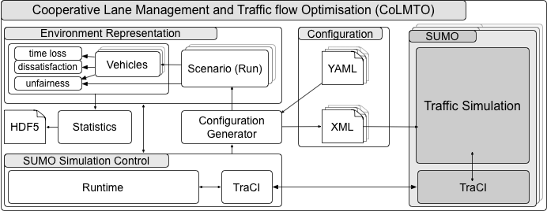

# Cooperative Lane Management and Traffic flow Optimisation (CoLMTO)

[](https://circleci.com/gh/SocialCars/colmto)
[](https://codecov.io/gh/SocialCars/colmto)

  * [Source Code Documentation (HTML)](http://socialcars.github.io/colmto/docs/sources/index.html)
  * [Source Code Documentation (PDF)](http://socialcars.github.io/colmto/docs/CoLMTO-doc.pdf)


## Architecture



## Build Instructions

### Prerequisites

* Python 2.7
* libhdf5
* libxml
* libyaml
* SUMO (as provided by build instructions for [MacOS](http://sumo.dlr.de/wiki/Installing/MacOS_Build_w_Homebrew), [Linux](http://sumo.dlr.de/wiki/Installing/Linux_Build), [Windows](http://sumo.dlr.de/wiki/Installing/Windows_Build). Also see [required libraries](http://sumo.dlr.de/wiki/Installing/Linux_Build_Libraries))

### Checkout CoLMTO

```zsh
git clone --recursive https://github.com/SocialCars/colmto.git
```

### Build SUMO Submodule (optional)

The version of SUMO currently used for my research is referenced as a submodule (hence the `--recursive` option above).

Feel free to use any other version, but make sure to set the `SUMO_HOME` environment variable correctly.

#### FreeBSD

```zsh
sudo portmaster devel/autoconf textproc/xerces-c3 graphics/proj graphics/gdal x11-toolkits/fox16
cd colmto/sumo/sumo
make -f Makefile.cvs
./configure --with-xerces=/usr/local --with-proj-gdal=/usr/local
make -jN
```

#### MacOS

```zsh
brew install Caskroom/cask/xquartz autoconf automake gdal proj xerces-c fox
export CPPFLAGS="$CPPFLAGS -I/opt/X11/include/"
export LDFLAGS="-L/opt/X11/lib"
cd colmto/sumo/sumo
make -f Makefile.cvs
./configure --with-xerces=/usr/local --with-proj-gdal=/usr/local
make -jN
```

#### Ubuntu (Yakkety)

```zsh
sudo apt-get install autoconf libproj-dev proj-bin proj-data libtool libgdal-dev libxerces-c-dev libfox-1.6-0 libfox-1.6-dev
cd colmto/sumo/sumo
make -f Makefile.cvs
./configure
make -jN
```

### Install CoLMTO Dependencies

#### FreeBSD

#### MacOS

```zsh
brew install libxml2 homebrew/science/hdf5 libyaml
```

#### Ubuntu Yakkety

```zsh
sudo apt-get install libyaml-dev libxslt1-dev
```

### Build and Install CoLMTO

```zsh
cd colmto
# run unit tests
python setup.py test
# install
python setup.py install --user
```

## Run CoLMTO

```zsh
export SUMO_HOME=~/colmto/sumo/sumo # adjust accordingly
cd colmto
python -m run --runs 1
```

CoLMTO provides a runner in the parent directory of the project (`run.py`) to start the simulation.
Basically it boils down to the following:

```python
import colmto.main

if __name__ == "__main__":
    colmto.main.Colmto().run()
```

Upon first start it creates YAML formatted default configurations and its log file in `~/.colmto/`:

```
~/.colmto/
├── colmto.log
├── runconfig.yaml
├── scenarioconfig.yaml
└── vtypesconfig.yaml
```

Further help on command line options can be obtained by running

```zsh
python -m run --help
```

## Copyright & License

  * Copyright 2017, Malte Aschermann
  * [License: LGPL](http://socialcars.github.io/colmto/LICENSE.md)
